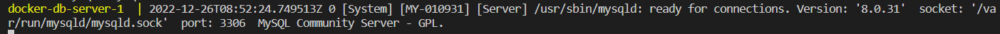

<h1>Overview:</h1>
This app consists of:
• embedded mySQL database
• python scripts which:
&emsp- connect to the local db
&emsp- upload data to the db
&emsp- execute sql queries and return data in json or xml
• pre-commit
• unit tests

Everything is executed by running the **docker-compose.yaml** file in docker directory,
which upon execution creates images of mysql and python using the corresponding Dockerfiles.
<h2>Running the app:</h2>
First off you've got to activate the venv.

To do that you have to run the following command from the root directory **\venv\scripts\activate**.
After that you'll have the virtual environment activated.

If you want to run the unit tests, go to the **tests** directory and run the ```pytest``` command.
To start the app you have to navigate to the **docker** folder and run ```docker-compose up``` in the terminal.
Next up you're gonna wait for the images and the container to build.
And when the log in the terminal stops and you'll see following message:



Cancel the process and run ```docker-compose up``` once again.
This is necessary due to the fact that the first time you run it,
the database doesn't have enough time to be created
before the python script execution (at least that's how I think it is).
Alright, now that you've run ```docker-compose up``` the second time,
you can see the logs and the queries printed in the terminal.
